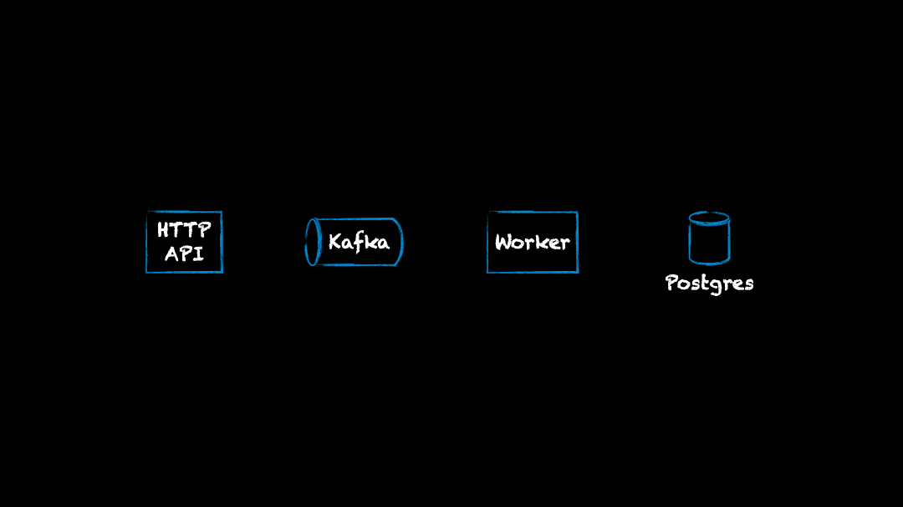

# Тестовое задание
Реализовать запись данных, отправленных по HTTP протоколу, в базу через Kafka.



Нужно написать HTTP API и Worker. Kafka и Postgres поднимаются как окружение через docker compose.

## Что понадобится?
- Docker версии 27.2.0 или выше.
- Go версии 1.21 или выше.
- Привычная среда разработки, например [VSCode](https://code.visualstudio.com/).
- Утилита для отправки сообщений в Kafka, например консольная [kcat](https://github.com/edenhill/kcat) или [плагин](https://github.com/jlandersen/vscode-kafka) для VSCode.
- Утилита для работы с БД Postgres, например [dBeaver](https://dbeaver.io/download/).

## Чуть подробнее о функционале

### HTTP API
Это сервис, который принимает запросы в формате JSON, отправленные на `/data` методом `POST` с заголовком `Content-type: application/json`.

Формат JSON следующий:
```json
{
    "user": "Max",
    "age": 31, 
    "email": "max@mail.com"
}
```
Типы данных:
- user [текст] - Имя пользователя
- age [число больше 0] - Возраст пользователя
- email [текст] - E-mail пользователя

Каждый полученный запрос с JSON от пользователя отправляются в Kafka топик `data`, который создаётся автоматически при старте окружения.

### Worker
Каждую секунду получает все доступные сообщения (JSON) из Kafka топика `data`, преобразует их в структуру и сохраняет в таблицу в базе данных `public.data`.

Структуру таблицы:
```sql
CREATE TABLE public."data" (
	id      serial4     NOT NULL,
	"user"  text        NOT NULL,
	age     int2        NOT NULL,
	email   text        NOT NULL,

	PRIMARY KEY (id)
)
```

## Окружение
В репозитории есть файл `compose.yml`, в нём описано окружение, необходимое для разработки (Kafka и Postgres).
Для работы с окружением используйте команды:
```bash
# Запустить окружение.
docker compose up -d

# Просмотр логов в потоковом режиме.
docker compose logs

# Остановить окружение.
docker compose down
```
Все команды нужно запускать в директории проекта.

### Kafka
Доступна локально: `localhost:9892`
Доступна из сети docker: `kafka:9092`
Целевой топик: `data`
SSL не используется.

### Postgres
Доступна локально: `localhost:5432`
Доступна из сети docker: `postgres:5432`
База данных: `test`
Пользователь: `postgres`
Пароль: `pass`
Целевая таблица: `public.data`

## Критерии проверки
1. Результат выполнения нужно загрузить в публичный репозиторий на github.
2. В репозитории должна быть инструкция для запуска вашего решения.
3. Код должен запускаться и работать на окружение, описанном в данном репозитории.
4. В случае не корректных входных данных (запроса от пользователя) должны возвращаться ошибка.
5. Будет плюсом, если напишите тесты.
